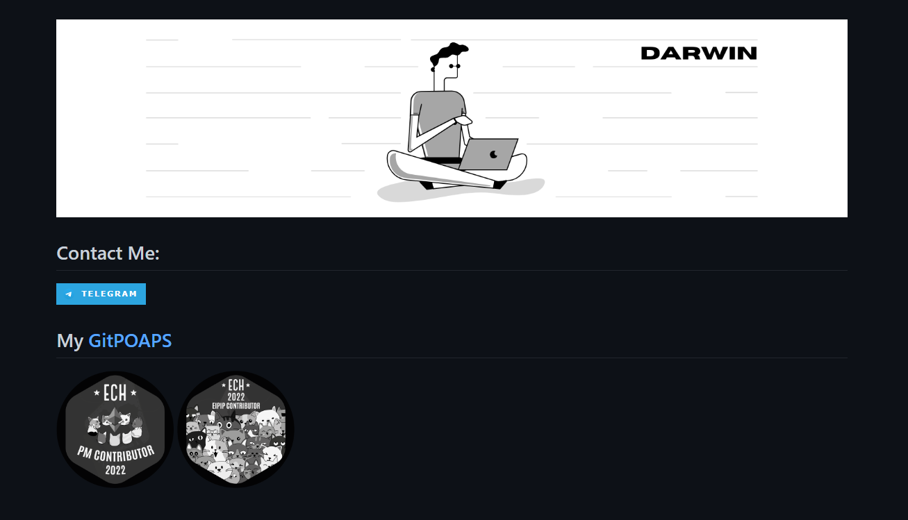

## About 
This repo is a SIMPLE static [GitPOAPs](https://www.gitpoap.io/) badge processor. The server fetch the `claimed` and `unclaimed` GitPOAP badge ***on request***.

## Build & Run
```console
git pull https://github.com/charmful0x/gitpoap-gh-badge.git

cd gitpoap-gh-badge

npm install .

npm start
```  

## API endpoint

- **API URL: https://gitpoap-gh-badge.herokuapp.com**

1- fetch POAPs by github username
- `GET /badges/:github_username/:badge_size?`

The `badge_size` parameter is optional, the default value is 150 (150 * 150)

Example: https://gitpoap-gh-badge.herokuapp.com/badges/charmful0x

## Usage

After hitting the API endpoint with your github username, the server will respond with an HTML code block, copy and paste that code block in your github's profile README repo (`username/username` repo). [Repo Example](https://github.com/charmful0x/charmful0x)



<center>
  <p>
    <a href="https://www.gitpoap.io/gp/138"
      ></a>
    <a href="https://www.gitpoap.io/gp/135"
      ></a>
  </p>
  <center></center>
</center>


## Roadmap
- [ ] dynamic all-in-one badges SVG generator

## TechStack
- GitPOAP API: [docs](https://docs.gitpoap.io/)
- Express

## License
This project is licensed under the [MIT license](./LICENSE)

